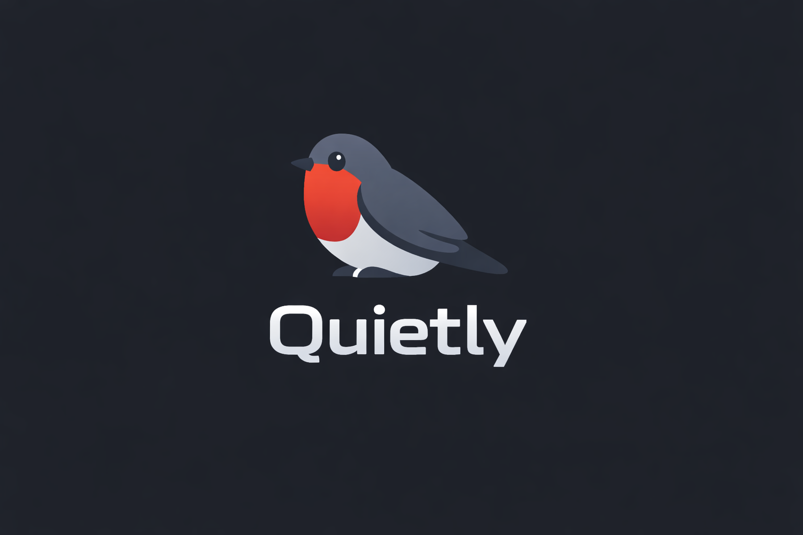

<p align="center">
  
</p>

<h2 align="center"><i>Tests that grow with your code - incremental, safe, automated.</i></h2>

Quietly is a Maven plugin for Quarkus/Hibernate projects. It scans JPA entities, reads Hibernate `@Filter` and `@FilterDef` metadata, and generates JUnit/RestAssured integration tests for REST filters.

Start here:

- [English documentation](docs/eng_.md)
- [Documentazione italiana](docs/it_.md)

Quick local install:

```bash
mvn clean install
```

Quick usage in another project:

```bash
mvn compile quietly:filter-tests
```

Generated tests are active by default, idempotent, and reported in:

```text
target/quietly/filters-report.md
```
